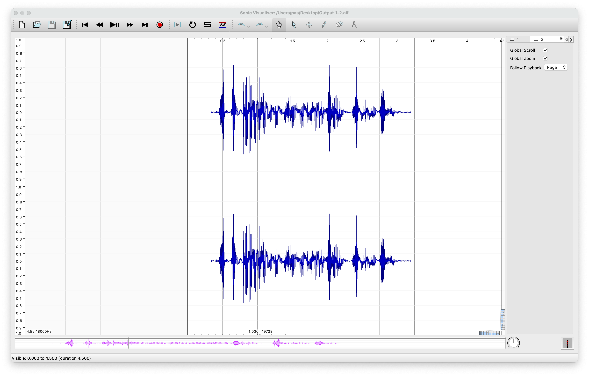
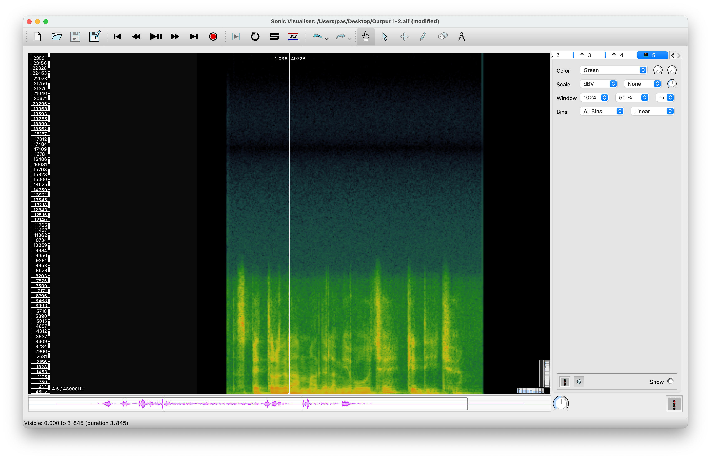
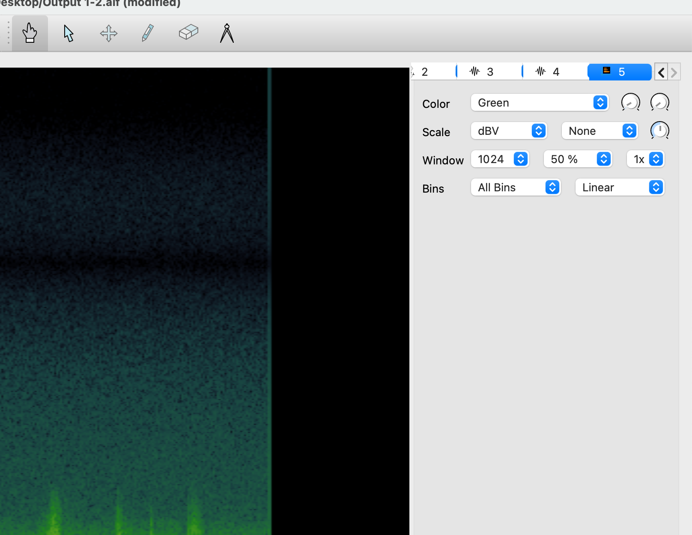
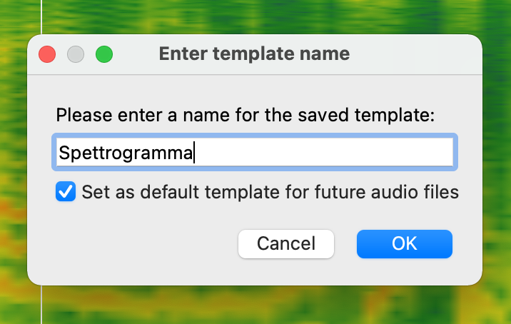

#### • SONIC VISUALIZER, un breve tutorial

<a href="https://sonicvisualiser.org/download.html" target="_blank">LINK</a> per Download

Una volta scaricato ed installato, aprendo il programma e caricando qualsiasi suono vi troverete questa interfaccia:

In automatico, il programma mostra la forma d'onda del suono - ovvero come l'intensità del suono si muove nel tempo.

Per visualizzare lo spettrogramma (quindi il dettaglio delle frequenze contenute nel suono) cercate nel menu *Layer* -> *Add Spectrogram* e scegliete *All Channels Mixed* se vi interessa vedere uno spettrogramma globale, altrimenti scegliete una delle altre voci se volete visualizzare, ad esempio, solo il canale destro o quello sinistro.

Dovreste quindi visualizzare qualcosa del genere:

Dal box a destra potete cambiare le impostazioni di visualizzazione dello spettro.

A parte il colore di visualizzazione, vi consiglio di modificare il valore di *Window* da 1024 ad almeno 4096 (è, in sostanza, la definizione dell'analisi delle frequenze quindi anche un maggiore o minore dettaglio di visualizzazione.).

E, vi consiglio anche di cambiare alla voce *Bins* ->*Linear*, modificandola con *Log* (passate da una visione delle frequenze lineari ad una visione logaritmica, più comoda. Se vi interessa saperne di più, scrivetemi)

Se, infine, volete salvare queste impostazioni e fare in modo che all'apertura di Sonic Visualizer, un file venga caricato direttamente con queste impostazioni senza doverle mettere a mano ogni volta, dal menu *File*, scegliete la penultima voce *Export Session as Template*, date un nome a questa impostazione e cliccate sulla voce *Set as default template for future audio files*  

